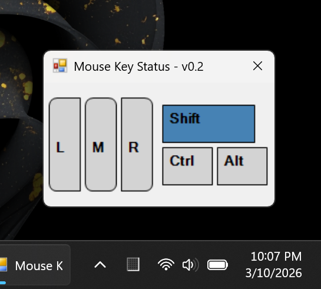
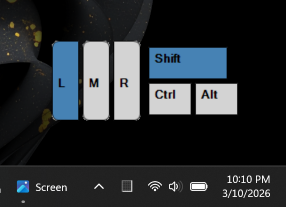

# MouseKeyStatus
Windows app to show on-screen mouse button and keyboard modifier key pressed states. Useful for showing mouse and key states while demonstrating or screen recording other software.

## Features
* Resizable Form to customize display width/height
* Show mouse button pressed states (Left, Middle, and Right)
* Show modifier key pressed states (Shift, Control, Alt)
* Presentation Mode -- double-click hides window title/border.
* Single exe native Windows app -- currently ~12k in size.
* Only dependency on .NET Framework 4.8.

The main form is resizable to adjust the size and aspect ratio to what best suites the display.

(MouseKeyStatus screenshot showing windowed mode)



Double-click anywhere on the visible form to enable "Presentation Mode". This hides the window title, border, and form background. Additionaly, the main window is set as a top-most form to appear on-top of other windows.

While in "Presentation Mode", the app may still be moved by simply left clicking and dragging on any visible button. To restore the windows title/border, simply double-click any visible area of the form.

(MouseKeyStatus screenshot showing transparent mode)




## Future Considerations
* Add right-click context menu for additonal options.
* Enable predefined and/or custom color themes.
* Option to include display of Back/Forward buttons (X1/X2)
* Allow control over visibility of displayed mouse buttons and modifier keys
* Add additional custom key area to show potential other regular key presses, such as arrow keys, alphabetic, number, and function keys.


```
Created by Taber
with a computer
```
